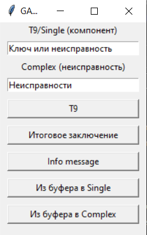

## AIM
_Данная программа предназначена для
шаблонизации текста технических заключений с дефектной ведомостью
(ТЗсДВ) и автоматизации процесса заполнения формы в 1С._ 

### Внешний вид представлен ниже:

Функционал представлен:
* два текстовых поля
* автозавершение наименования компонента или неисправности
* формирование текста итогового заключения
* вывод списка сокращений
* ввод из буфера в первое текстовое поле
* ввод из буфера во второе текстовое поле

Первое текстовое поле используется для автоматизации: набора 
компонента медицинского изделия, описания типичной неисправности. Полное описание приводится при наборе во втором текстовом поле.

Второе текстовое поле необходимо для составления итогового заключения путем
 объединения описания неисправности(-ей) с приведением соответствующего(-их) компонента(-ов) в родительный падеж.

Кнопка "Т9" копирует полное описание, приведенное во втором текстовом поле, в буфер обмена. 
Кнопка "Итоговое заключение" генерирует объединение описания неисправностей и компонентов, отправляет итог в буфер обмена.

Список сокращений приведён в алфавитном возрастающем порядке. Самые частые фразы имеют небуквенное значение.

Две последних кнопки переносят текст из буфера обмена в первое и второе текстовые поля соответственно.

##Дополнительно

###общая_схема_работы-Страница 4.pdf
Визуализация схемы работы отдела списания. Основной идеей является структурирование описания (шаблонизация) неисправностей инженерами, что позволит повысить эффективность их труда и станет источником данных о частоте поломок. Я давно пытался структурировать процесс списания, но оформление было готово буквально на прошлой неделе. Восклицательными знаками отмечены этапы, которые могут быть улучшены. Цифрой - что уже улучшено и применяется.

###helloD.xlsm
Свод всех макросов для отдела списания медицинского оборудования ГАУ "Гормедтехника"

